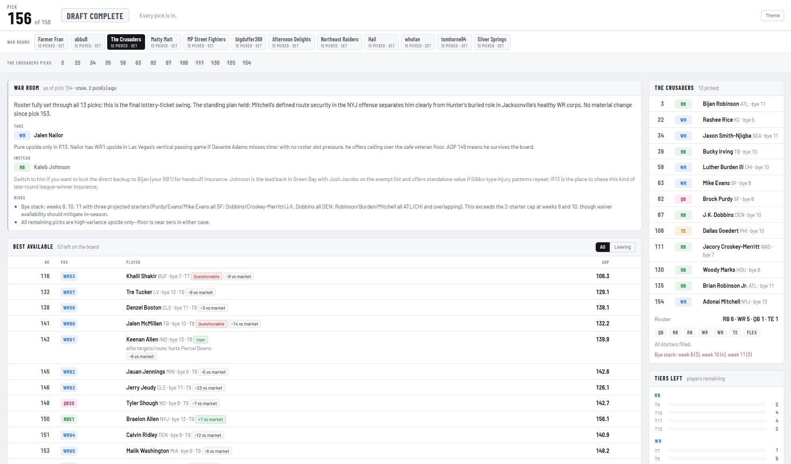

# Sleeper draft assistant

A live draft board for a twelve-team fantasy football league, built in a weekend with Claude
Code and used for one draft. It polls the Sleeper public API, crosses picks off a hand-built
ranking board, and serves a page carrying one war room per seat — every manager opens the same
URL and bookmarks their own view.



Two days, two interfaces:

- **Day one — a coding agent reading files.** `sleeper-live` rewrote `draft/state/NOW.md` every
  couple of seconds and Claude Code answered "who do I take?" from it, in a terminal, for one
  seat. That MVP still works and is documented under
  [the day-one path](#the-day-one-path-a-coding-agent-reading-draft).
- **Day two — the web app**, and the primary interface now. The same derived state, rendered
  for twelve seats instead of one, with a per-team AI brief and a public URL so the rest of the
  league can use it.

Scope is one league, one draft, three hours: no login, no accounts, no multi-league support, no
database, no persistence layer. Read-only against Sleeper — nothing is written back, nothing
is scraped.

## Architecture

Five parts, sharing nothing but the filesystem. Only two of them run during the draft — the
poll loop, which serves the page from a thread inside itself, and the war room.

1. **`sleeper-board` — offline build step.** Joins the name-keyed rankings in `research/` to
   Sleeper `player_id`s, failing on any name it cannot resolve, and writes `draft/board.json`,
   `draft/board.md`, `draft/pick_order.json`. Nothing at draft time needs a player's name.
2. **`sleeper-live` — poll loop.** Fetches `/draft/<id>/picks` every 2s, recomputes the whole
   state from picks + board, rewrites `draft/state/`: `NOW.md` for one seat, one file per other
   seat, and `state.json` for the league. Pure function of (picks, board) — no accumulated
   state, no migrations. Every file goes through a temp name and `os.replace`, so a reader
   landing mid-write still gets the previous poll's file intact.
3. **`serve.py` + `live_view.html` — the web app.** Stdlib `ThreadingHTTPServer` on a daemon
   thread with two literal routes: the packaged HTML, and the `state.json` the loop just wrote.
   Request paths are never joined to a directory. The page is vanilla JS, no build step, polls
   once a second, re-renders in place, and switches between the twelve seats client-side.
4. **`sleeper-warroom` — optional agent layer.** Watches the same directory and writes one
   brief per team into `draft/state/briefs.json`. No lock, no Sleeper requests, no shared
   memory. Kill it mid-draft and the page loses one panel.
5. **A coding agent reading `draft/` directly** — the day-one path, still supported. Framed by
   `.claude/skills/draft-day/SKILL.md`.

No queue, broker, worker pool, cache tier, schema, ORM or framework, and no IPC — the two
running processes never address each other. One runtime dependency (PyYAML; plus the Anthropic
SDK for briefs). State is rebuilt from scratch every 2s, so recovery is one cycle and
deployment is copying files in.

### Heavy analysis offline, cheap application live

All expensive analysis runs days early; the live layer only applies it.

Offline, once: 220 player notes in [`research/players/`](research/players/) (~470KB, one file
per player, filename ending in the `player_id`); three ranking sources aggregated into
`research/rankings_2026.json`; scouting lines, risk flags and handcuff pairs in
`research/scouting_notes.json`. Distilled by hand into two documents:

- **[`draft/STRATEGY.md`](draft/STRATEGY.md)** — the reasoning. VORP and replacement level for
  this roster config, when each structural approach fits, the QB1–QB12 gap, the TE cliff, the
  RB dead zone, handcuffing, stacking correlation, per-slot playbooks, citations.
- **[`draft/PLAYBOOK.md`](draft/PLAYBOOK.md)** — the operational subset, and the only one read
  on the clock: hard constraints, pick table, per-pick algorithm, real cliffs, numeric
  thresholds, adaptation triggers.

`sleeper-board` compiles the research into a 208-row board keyed by `player_id`.

Nothing is recomputed during the draft. The live question is narrow: which ranked players are
gone, how many picks until this seat comes back, whose ADP falls inside that window, which
tiers are down to their last two. That is arithmetic over a table — `live.py` does it with no
model, in milliseconds.

The model at draft time is doing lookup and application. It reads `draft/state/NOW.md` for
current state, `PLAYBOOK.md` for the decision rules, and — since `player_id` is the join key
everywhere — one 2KB research note for the player in question, out of 470KB. The war-room
briefs read the compiled board the same way, which is why twelve of them per pick are
affordable.

The driver is the 300s pick clock: analysis started when the clock starts cannot be checked
before the pick is due. The cost of pushing it earlier is staleness, and PLAYBOOK §12 and
STRATEGY §14 list what drifts (ADP daily, injuries) and what does not (the 3RR math is exact
and static).

## The web app

One page, twelve war rooms. The state file carries the shared board once plus a block per slot,
so the server does no per-user work and the twelve rooms cost the same two Sleeper requests as
one: `summarize_league()` computes everything true of the draft whatever seat you read it from,
`slot_view()` computes only the part that depends on the seat.

What a manager sees in their own room:

- **The war-room strip** across the top switches seats and writes the URL hash, so each manager
  bookmarks their own room. Seating is provisional until the draft order is drawn, and the page
  says so.
- **Best available**, one ranked board with a `leaving` flag and severity stripe on players whose
  market ADP puts them gone before that seat's next pick, plus a filter to narrow to just those.
  Filtering by ADP yields a strict subset in the same order, so a separate at-risk table would
  print the same players twice.
- **The pick rail** shows that seat's own pick numbers with the next one ringed, which makes the
  third-round-reversal cluster visible (slot 12: 12 · 13 · 25).
- **Roster and open starting slots**, tier bars that turn red at the two-left tier-break trigger,
  bye-stack warnings, and position colour chips (QB magenta, RB green, WR blue, TE amber) so the
  board is scanned by shape rather than read.
- **The brief panel** — the agent's proposed pick, an alternative with what would flip it, and
  the risks — when `sleeper-warroom` is running. It is labelled with the pick it was written at,
  so a stale brief announces itself.
- **Around the league**: what every other team still has to fill. This is colour for the
  broadcast; urgency stays anchored to market ADP, because twelve rooms reading each other's
  needs and all reaching a round early is a feedback loop.

A page that freezes while still looking healthy is the failure that costs a pick, so it
banners as soon as polls stop arriving.

## Deployment

Railway watches `master` on the GitHub repo: a merge there builds the `Dockerfile` and
redeploys. Work happens on branches and lands through pull requests, so pushing a branch
deploys nothing.

One container, two processes: `docker-entrypoint.sh` supervises the poller and the war room and
restarts either on exit, never faster than `RESTART_DELAY`. `numReplicas = 1` in `railway.toml`
is load-bearing: two replicas means two pollers against Sleeper's shared public API and two war
rooms billing the same twelve briefs, with nothing coordinating them.

No volume. Everything under `draft/state/` is derived, so a restart rebuilds it in one poll.
The board is baked into the image and the entrypoint refuses to start without
`draft/board.json` rather than serving an empty board, so `sleeper-board` is a build step you
run and commit. No players dump ships or is fetched at runtime: ~1.2MB of runtime input, no
cold start.

Config is env vars on the service: `SLEEPER_DRAFT_ID` (required — the committed board carries
the league's shape but not its ids), `SLEEPER_LEAGUE_ID` (optional, and only used to name the
twelve seats; without it they are numbered), `SLEEPER_SLOT`, `POLL_INTERVAL`, and
`ANTHROPIC_API_KEY` (without it the entrypoint logs once and starts the poller alone). `PORT`
and `HOST` come from the platform.

**Caveat:** this puts a stdlib HTTP server on the public internet. The exposure is bounded —
three literal routes, read-only, nothing to steal, up for two days — but there is no protection
against resource exhaustion: a thread per connection, no timeouts, no request size limits. The
platform edge does that work. Do not leave it up after the draft, and do not reuse the pattern for
anything long-lived.

## Repo layout

```
pyproject.toml            project metadata, deps, console scripts
uv.lock                   pinned resolution
.env.example              copy to .env; league id, slot, optional API key
config.example.yaml       shape of the generated config (the real one is gitignored)
byes.template.json        32-team bye map to fill in (see "Bye weeks")
src/sleeper_draft/
    client.py             API wrapper + disk cache for the 5MB players dump
    discover.py           league -> draft/scoring/roster config
    batches.py            ordered research list, chunked into YAML files
    past_draft.py         walk previous_league_id back, save a draft fixture
    board.py              rankings + research notes -> the in-draft board
    live.py               poll the live draft -> the current-state files
    serve.py              two-route stdlib server for the live page
    live_view.html        the live page itself (vanilla JS, no build step)
    keepers.py            last season's draft + rosters + trades -> keeper eligibility
    env.py                reads .env before any parser defaults from os.environ
    yamlio.py             shared YAML output settings
src/sleeper_draft/warroom/
    brief.py tools.py     pure brief-building + the agent's read-only tools
    agent.py runner.py    the only files that call a model; optional extra
research/rankings_2026.json    aggregate rankings, keyed by name -- the board's input
research/scouting_notes.json  one-line scouting + flags + handcuff pairs, keyed by player_id
research/players/         one markdown note per player, filename ends in player_id
draft/                    what the in-draft assistant reads (see "The draft/ directory")
tests/                    offline tests; no test touches the network
```

## The day-one path: a coding agent reading `draft/`

The original interface, and still the one that answers open-ended questions the page cannot.
Asking "who do I take?" is not an engineering conversation, but an agent in a code repo will
treat it as one. `.claude/skills/draft-day/SKILL.md` reframes the session as draft advice and
keeps the scope open — a player, a position, the shape of the board, a run, a keeper.

Its central instruction is to **situate the question in where the draft actually is**: "what do
you think of Bucky Irving?" is a different question when he is about to be taken, when he
survives to your next pick, and when you pick in four rounds. It also fixes the rules that must
not break — never recommend a drafted player, never suggest a kicker, re-read
`draft/state/NOW.md` before every answer because a poller is rewriting it.

Claude Code picks it up from the question. Other agents read `AGENTS.md`, which points at the
same file.

```bash
make watch SLOT=12     # terminal 1: polls, serves the page, rewrites NOW.md
                       # terminal 2: your agent, reading draft/
```

## Setup and make targets

```bash
uv sync --extra warroom             # .venv + PyYAML + dev group + this package
cp .env.example .env                # then fill in SLEEPER_LEAGUE_ID
uv run sleeper-discover --out config.yaml
uv run pytest                       # the whole suite, offline
```

`.env` is read by every command before argparse builds its defaults, so
`SLEEPER_LEAGUE_ID` / `SLEEPER_USERNAME` / `SLEEPER_SEASON` / `SLEEPER_SLOT` /
`ANTHROPIC_API_KEY` can be set once instead of passed each time. Anything already exported
wins over the file, which is what keeps Railway — real env vars, no `.env` — behaving like a
laptop.

`config.yaml` and `draft/keepers.*` are gitignored: they name a real league and its twelve
managers. `config.example.yaml` shows the shape, and `sleeper-discover` regenerates the real
one.

The committed board carries the league's **shape** — teams, rounds, reversal round, roster slots,
scoring — and not its **identity**. `league_id` is a lookup key into a public unauthenticated
API, where `GET /league/<id>/users` returns every manager's display name, so a published
`board.json` holding one would undo the rest of this. `sleeper-live` takes both ids from the
environment instead: `SLEEPER_DRAFT_ID` is required, `SLEEPER_LEAGUE_ID` only names the seats.

Everything except YAML emitting is standard library. PyYAML handles one trap: bare YAML 1.1
reads the team abbreviation `NO` as boolean `false`, and PyYAML's resolver quotes it. There is
a test pinning that.

No league ID, draft ID, username or season is hardcoded — CLI args, or `SLEEPER_USERNAME` /
`SLEEPER_SEASON` / `SLEEPER_LEAGUE_ID` / `SLEEPER_CACHE_DIR`.

`make help` lists the targets, all thin wrappers over the `uv run` commands below:

```bash
make setup            # uv sync
make check            # format + lint + types + test; the pre-commit gate
make board            # rebuild draft/board.*
make keepers          # rebuild draft/keepers.*
make watch SLOT=12    # poll the draft and serve the live page
```

`LEAGUE` resolves in order: an exported `SLEEPER_LEAGUE_ID`, then `.env`, then `config.yaml`.
Override `SLOT`, `LEAGUE`, `PORT`, `BYES` on the command line. GNU make is not installed on a bare WSL/Debian box
(`sudo apt install make`); everything works without it.

---

## Usage

### 1. `sleeper-discover`

```bash
uv run sleeper-discover --out config.yaml                            # uses SLEEPER_LEAGUE_ID
uv run sleeper-discover --league-id <id> --out config.yaml
uv run sleeper-discover --username <name> --season 2026              # if you don't know the ID
```

A league ID needs no user lookup. Prints a pasteable YAML block: `draft_id`, full draft
settings, `rounds`, `teams`, `reversal_round`, `slot_to_roster_id`, `draft_order`,
`roster_positions`, `scoring_settings`, `previous_league_id`.

`reversal_round` is not in Sleeper's public docs, so the command reports what it finds: an
absent key prints every settings key present; `0` or `null` says Sleeper reports no reversal.
Check it before trusting it for 3RR.

### 2. `sleeper-batches`

```bash
cp byes.template.json byes.2026.json   # then fill in the weeks
uv run sleeper-batches --byes byes.2026.json
```

Writes `research/batches/batch_01.yaml` … with 220 QB/RB/WR/TE at 15 per file, plus a final
`batch_NN_k_def.yaml` with 12 kickers and 12 defenses:

```yaml
players:
- player_id: '4046'
  name: Josh Allen
  pos: QB
  team: BUF
  bye: 12
  search_rank: 5
```

Flags: `--limit 220`, `--chunk-size 15`, `--kickers 12`, `--defenses 12`,
`--out-dir research/batches`, `--refresh-players`.

The first run fetches the 5MB dump into `.cache/sleeper/`; later runs reuse it until it is 24h
old and print the cache age either way.

### 3. `sleeper-past-draft`

```bash
uv run sleeper-past-draft --back 1
uv run sleeper-past-draft --league-id <id> --season 2025
```

Walks `previous_league_id` back and saves `fixtures/draft_<season>_<draft_id>.json`: the chain
walked, league metadata, the full draft object (settings, `reversal_round`,
`slot_to_roster_id`) and every pick with `pick_no`, `round`, `draft_slot`, `roster_id`.

That is the 3RR check — generate the expected `(round, slot) -> pick_no` table and diff it
against the fixture. Refuses to save a draft whose pick count is not `teams * rounds`;
`--allow-partial` overrides.

### 4. `sleeper-board`

```bash
uv run sleeper-board
uv run sleeper-board --rankings research/rankings_2026.json --out-dir draft
```

`research/rankings_2026.json` keys players by **name**; the live pick feed keys them by
**`player_id`**. This does that join once, offline, and writes `draft/board.json`,
`draft/board.md`, `draft/pick_order.json`.

Matching is on normalised name + fantasy position — accents, punctuation and generational
suffixes folded — indexed on `fantasy_positions` rather than `position`, so players Sleeper
files under a defensive position still match (Travis Hunter is `position: DB`,
`fantasy_positions: [DB, WR]`). A row matching nothing, or matching two players the tiebreakers
cannot separate, is a hard error naming every offender; nothing is written. `NAME_ALIASES`
carries the spelling disagreements between sources and Sleeper.

`research/scouting_notes.json` is already keyed by `player_id` and merges straight on: a
one-line note, flags (`risk`, `riser`, `faller`, `value`, `handcuff`, `dead_zone`), and
`handcuff_for` links. An unknown id, an unknown flag, or a dangling `handcuff_for` is a hard
error — a dropped note is research that silently disappears.

`pick_order.json` is derived from the snake + reversal rule and then checked against the
rankings file's own pick map. 3RR is undocumented, so two independent derivations must agree
before a draft is planned around them.

---

### 5. `sleeper-live`

```bash
uv run sleeper-live --slot 12                 # one shot
uv run sleeper-live --slot 12 --watch         # poll until the draft completes
uv run sleeper-live --username <name> --watch --interval 5
uv run sleeper-live --slot 12 --watch --serve     # + a live page in the browser
```

The draft comes from `--draft-id` or `SLEEPER_DRAFT_ID`, and the seat names from `--league-id`
or `SLEEPER_LEAGUE_ID` — the board carries neither. Without a league id the twelve rooms are
numbered rather than named; without a draft id it exits 1 saying so.

Polls `/draft/<id>/picks` and rewrites `draft/state/`. Everything but the picks comes from what
`sleeper-board` built — `board.json` supplies rank, tier, ADP, flags and scouting per
`player_id`, `pick_order.json` supplies the 3RR pick numbers — so a poll is one small request.

`NOW.md` is in reading order: whose pick and how many until yours returns; your roster and open
starting slots; **one** board of best available with a `Gone by <pick>?` column marking anyone
whose market ADP falls within `--cushion` of the pick you must survive to; tier counts; recent
picks and runs.

Urgency is a column on that board. Filtering by ADP yields a strict subset in the same order,
so a second table printed the same players twice; reading one board top-down and taking the
highest row marked `YES` *is* PLAYBOOK D1.

Slot comes from `--slot`, or `--username` resolved through `draft_order`. Without one the
timing maths is skipped rather than guessed — nothing is marked leaving and "picks until my
next" is absent.

208 players are ranked and 156 picks get made, so a rival drafting someone unranked is normal:
those are recorded from Sleeper's pick metadata and listed under "Off-board picks".

#### `--serve`: the web app

A stdlib HTTP server on a daemon thread while the main thread polls. The two share only the
filesystem.

    /            live_view.html, packaged next to the module
    /state.json  <out-dir>/state.json, Cache-Control: no-cache + an ETag

Those are the only routes, and the handler never joins a request path to a directory, so
traversal is impossible by construction.

`no-cache` rather than `no-store`: both forbid answering from cache without asking — the
property that matters, since a stale `state.json` freezes the page while it looks healthy — but
`no-store` also forbids keeping the copy, so every poll re-downloads the file. `no-cache`
revalidates and answers 304 when nothing changed, so a once-a-second poll usually costs an
empty response. The ETag hashes the body rather than mtime-and-size, because this route must
never claim "unchanged" about a state that changed.

What the page shows is described under [the web app](#the-web-app). It stays up after polling
stops — draft over, or a one-shot run — until Ctrl-C. Google Fonts is the one external request,
with a full fallback stack; the data path is localhost only.

**`--host` defaults to `127.0.0.1`.** `--host 0.0.0.0` publishes your at-risk list, roster plan
and scouting notes to the network. It warns when you do it.

---

### 6. `sleeper-keepers`

```bash
uv run sleeper-keepers
uv run sleeper-keepers --league-id <id> --season 2025
```

Rules who each team may keep and what the pick costs. Reuses `walk_back` to reach last season,
then reads that season's draft, final rosters and the full transaction log.

Eligible iff **all four** hold: that team drafted him, he is on their final roster, no completed
transaction dropped him from it, and he was not last season's keeper. Cost is his draft round.

"On the final roster" and "never left" are different questions: a player dropped in week 3 and
re-added in week 9 passes the first and fails the second, which is why the transaction log is
read at all. Disagreements between the two are listed at the foot of the report.
Trades need no special case: Sleeper puts the losing side in `drops`.

With `draft/board.json` present, each eligible player also carries this year's **public market
ADP**, which turns eligibility into a decision — a round-5 keeper cost reads differently against
a market pick of 19. Sections are headed by team name, falling back to username.

Only ADP is taken off the board. This report is circulated to the league, so our own rank, tier,
scouting and flags never reach it; a test asserts that.

---

## The `draft/` directory

| File | What it is | Written by |
|---|---|---|
| `PLAYBOOK.md` | Standing doctrine: constraints, pick order, the pick algorithm, cliffs, thresholds, risk flags. Load first, every session. | hand-maintained |
| `STRATEGY.md` | The reasoning behind it: VORP math, structural approaches, QB/TE gap data, dead zone, handcuffing, stacking, slot playbooks, market inefficiencies, citations. | hand-maintained |
| `board.md` | 208 ranked players by tier, with `player_id`, source ranks and risk flags, plus a positional index and the researched-but-unranked bin. | `sleeper-board` |
| `board.json` | The same board, machine-readable. | `sleeper-board` |
| `pick_order.json` | `picks_by_slot` and `slot_by_pick` for 12 slots x 13 rounds. | `sleeper-board` |
| `state/NOW.md` | Live state: whose pick, roster and gaps, the board with players leaving before your pick marked, tiers left, recent picks and runs. | `sleeper-live` |
| `state/state.json` | The same, machine-readable, whole league. | `sleeper-live` |
| `state/briefs.json` | One agent brief per team. | `sleeper-warroom` |
| `keepers.md` | Per-team keeper eligibility and cost. The report to circulate — gitignored, since it names every manager. | `sleeper-keepers` |
| `keepers.json` | The same ruling, machine-readable. Gitignored for the same reason. | `sleeper-keepers` |

The join key is `player_id` throughout: live pick -> board row ->
`research/players/*-<player_id>.md`.

Read the `.md`; the `.json` is machine input. Both hold the same information, the JSON 4-7x
larger because it repeats every field name on every row. `board.json` and `pick_order.json` are
what `sleeper-live` parses.

---

## What's actually in `/players/nfl`

Fields read off the live dump:

| Field | Type | Notes |
|---|---|---|
| `player_id` | string | Map key too. Defenses use the team abbreviation (`"CAR"`), not a number. |
| `search_rank` | int / null | Lower = more prominent. `9999999` is the "irrelevant" sentinel; some rows are `null`. |
| `position` | string / null | `null` on placeholder rows like "Duplicate Player". |
| `fantasy_positions` | list / null | Can be `null`; can hold multiple (`["DB","LB"]`). |
| `team` | string / null | `null` means free agent, including for active players. |
| `active` | bool | Independent of `status`; a player can be `active: true`, `status: "Inactive"`. |
| `full_name` | string / null | Absent on some rows; names fall back to `first_name` + `last_name`. |
| `depth_chart_order` | int / null | Within-team ordering only, mostly null. |
| `years_exp`, `status`, `injury_status`, `number`, `age` | mixed | Context, not ranking. |

**No ADP field, no projection field, no bye week field.**

### Ordering

`search_rank` is the only ranking signal, so `sleeper-batches` sorts by it ascending. It is
prominence, not ADP — roughly tracking draft interest at the top and noisy in the tail, with
repeated values like `999`. Ties break by position, then name, then `player_id`, so runs are
stable across days.

Rows are excluded when `search_rank` is `null` or the `9999999` sentinel, when `active` is not
`true`, or when `team` is `null` — a genuine free agent would otherwise sort into the middle of
the list with no team and no bye.

True ADP is not in this API; pull it from last year's picks (`sleeper-past-draft`) or an outside
source.

### Bye weeks

Not on the player object, and not on any documented endpoint. Rather than guess at an
undocumented schedule endpoint, `sleeper-batches` requires `--byes` pointing at a JSON map:

```json
{"ARI": 8, "ATL": 5, "BAL": 7}
```

`byes.template.json` has all 32 abbreviations with `0` placeholders. `0` is rejected on purpose,
so a half-filled file fails loudly. Any team missing from the map is named, and nothing is
written.

---

## Failure behaviour

Every command raises and exits 1 rather than defaulting:

- unknown username, league or draft ID (Sleeper returns JSON `null`; that is named as such)
- a missing `slot_to_roster_id`, `rounds`, `teams`, `roster_positions` or `scoring_settings`
- a player with no resolvable name (the `player_id` is printed)
- any team missing from the bye map (all listed at once)
- fewer players surviving the filters than `--limit` requested
- a `previous_league_id` chain that ends before the season requested

## Rate limiting

The client spaces requests at least 100ms apart and caches the players dump for 24h. Live
polling nets ~0.53 req/s against Sleeper's 1000/min guidance.

## Testing and CI

Fully offline, against a synthetic players dump and a stubbed client: the filters, the
ordering, the YAML round-trip, the 3RR pick table against real numbers, the keeper rules, the
pick-timing maths, and every failure path above.

Every function in `src/` carries parameter and return annotations, enforced by ruff's `ANN`
rules rather than by review; `tests/*` is exempt, since a test's signature is its fixture list.

`.github/workflows/ci.yml` runs `ruff format --check`, `ruff check`, `pyright` and `pytest` on
every push to `master` and every pull request — the same four steps as `make check`, in the same
order, so a green tick means the local gate would have passed. No network and no API key: the
suite needs neither.
